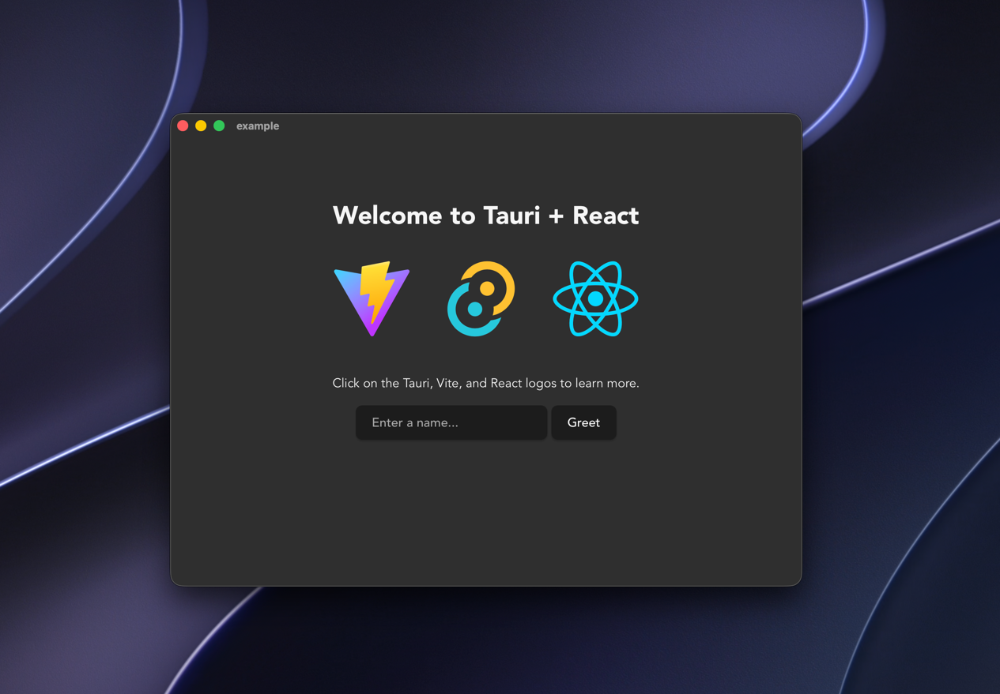

import { Image, Figure, Figcaption } from '@/components/mdx/image';
import thumbnail from './thumbnail.png';
import windows from './windows.png';

# Tauri 어플리케이션에서 네이티브 앱 느낌 내기

export const metadata = {
  tags: ['Tauri', 'React'],
  published: '2026-06-28',
  thumbnail,
};

Tauri는 데스크톱 어플리케이션을 제작하기 위한, 더할 나위 없이 좋은 프레임워크입니다.
이 포스트에서는 Tauri 어플리케이션 창을 커스텀하여 진짜 네이티브 앱과 구분하기 어려울 정도로 만드는 방법에 대해 작성하고,
이를 위해 제가 개발한 Tauri Plugin에 대해 소개합니다.

## Frameless Window

`create-tauri-app`으로 프로젝트를 생성하였다면, 다음과 같은 화면을 마주하게 될 것입니다.



대부분의 상업용 어플리케이션은 타이틀 바에 커스터마이징이 들어갑니다. 하지만 Tauri의 기본 프리셋으로는 이를 달성할 수 없습니다.
Tauri의 [Window Customization](https://tauri.app/learn/window-customization/)에서 설명하는 내용으로는
다음과 같은 설정으로 Frameless Window를 달성할 수 있습니다.

```rust
use tauri::{AppHandle, WebviewWindow, WebviewWindowBuilder};

pub fn main(app: AppHandle): Result<WebviewWindow> {
    let builder = WebviewWindowBuilder::new()
        .title("Tauri App")
        .min_inner_size(1280.0, 720.0)
        .inner_size(1280.0, 800.0);

    #[cfg(target_os = "macos")]
    let builder = {
        use tauri::{TitleBarStyle, LogicalPosition};
        builder
            .title_bar_style(TitleBarStyle::Overlay)
            .hidden_title(true)
            .traffic_light_position(LogicalPosition::new(18.0, 24.0))
    };

    #[cfg(target_os = "windows")]
    let builder = {
        builder.decorations(false).shadow(true)
    };

    Ok(builder.build(app)?);
}
```

이 방식은 macOS에서는 거의 완벽에 가깝게 설정할 수 있습니다. 하지만:

- Windows에서는 타이틀 바가 제거되기 때문에 이를 직접 구현해야 합니다.
- 아이콘을 직접 삽입하고 버튼도 직접 배치해야 합니다.
- 기능을 동작하게 하기 위해 Tauri API를 직접 사용하고, 버튼에 이벤트 리스너를 등록해야 합니다.
- 이렇게 해도 '최대화' 버튼에 마우스를 올려 사용할 수 있는 Snap Layout 기능은 사용할 수 없습니다.
- 여러 창을 생성해야 하는 어플리케이션에서 일일이 설정하기 귀찮습니다.

문제를 해결하기 위해 2개의 Tauri Plugin을 직접 제작하였습니다. 이를 사용하면, 창 생성 포인트를 다음과 같이 단축할 수 있습니다:

```rust
use tauri_plugin_frameless_window::WebviewWindowBuilderExt;

let builder = WebviewWindowBuilder::frameless(app, label, url)
    .title("uPilot")
    .transparent(true)
    .min_inner_size(1280.0, 720.0)
    .inner_size(1280.0, 800.0);

#[cfg(target_os = "macos")]
let builder = {
    use tauri::LogicalPosition;
    builder.traffic_light_position(LogicalPosition::new(18.0, 24.0))
};

#[cfg(target_os = "windows")]
let builder = {
    use tauri_plugin_window_controls::WindowControlsBuilderExt;
    builder.title_bar_height(44)
};

builder.build()?;
```

- [**`tauri-plugin-frameless-window`**](https://github.com/insd47/tauri-plugin-window-controls)에서는
  `::frameless` 생성자를 제공하여, 까먹기 쉬운 frameless window 생성 분기를 한 번에 처리하여 줍니다.
- [**`tauri-plugin-window-controls`**](https://github.com/insd47/tauri-plugin-window-controls)에서는
  `title_bar_height(u32)`를 제공하여 네이티브 아이콘을 사용하여 구현된 Window Controls를 오버레이하며,
  macOS의 `traffic_light_position`처럼 직접 높이를 조절할 수 있습니다.

`tauri-plugin-frameless-window`는 내부적으로 `tauri-plugin-window-controls`의
`title_bar_overlay(true)`를 호출하는 의존 플러그인입니다. 만약 `frameless-window` 플러그인을 사용하고 싶지 않다면,
이를 직접 호출하여 활성화할 수 있습니다.

> Frameless 창은 타이틀 바 없이 Window Control만 오버레이 된 구조이므로, `data-tauri-drag-region`
> property를 활용하여 드래그 가능한 영역을 직접 지정하여야 합니다.

## Translucent Background

반투명 창은 그 역사가 2007년 Windows Aero까지 거슬러 올라갈 정도로 데스크톱 어플리케이션에서 오랫동안 사랑받아온
인터페이스 요소입니다. Electron과 Tauri 어플리케이션이 태동할 때쯤은 플랫 디자인이 유행하였기 때문에
투명 창 기능의 지원에 상대적으로 빈약했지만, macOS Big Sur나 Windows 11부터는 이러한 효과가 다시 널리 사용되고 있습니다.

Tauri에서는 `WindowEffect`라는 이름으로 이러한 기능을 제공하고 있습니다.
다음은 Tauri 앱에서 투명 Window를 설정하는 예제입니다.

```rust
let builder = WebviewWindowBuilder::new();

...

#[cfg(target_os = "macos")]
let builder = {
    use tauri::window::Effect::Sidebar;
    builder.effects(EffectsBuilder::new().effect(Sidebar).build())
};

#[cfg(target_os = "windows")]
let builder = {
    use tauri::window::Effect::Mica;
    builder.effects(EffectsBuilder::new().effect(Mica).build())
};
```

만약 `tauri-plugin-frameless-window`를 사용한다면, 이렇게도 사용할 수 있습니다.

```rust
use tauri_plugin_frameless_window::WebviewWindowBuilderExt;
let builder = WebviewWindowBuilder::frameless();

...

#[cfg(target_os = "macos")]
let builder = {
    use tauri::window::Effect::Sidebar;
    builder.effect(Sidebar)
};

#[cfg(target_os = "windows")]
let builder = {
    use tauri::window::Effect::Mica;
    builder.effect(Mica)
};
```

- Windows에는 Windows 11의 `Mica`, macOS에서는 `Sidebar` material을 적용합니다.
- EffectBuilder의 보일러플레이트가 꽤나 복잡해서, Frameless Window 플러그인에 단일 Effect 메서드를 만들었습니다.
- Windows 10을 지원해야 하는 앱이라면 빌드 번호에 따른 분기를 고려해야 할 수도 있습니다.
- 효과가 제대로 활성화되려면, `html`과 `body`, 기타 DOM 요소에
  `background-color`가 `transparent`로 설정되어 있어야 합니다.
- **중요**: macOS에서 Window Effect를 사용하려면 Private API를 활성화해야 하며,
  이는 Mac App Store에 어플리케이션을 게시할 수 없음을 의미하므로 유의하여 주세요.


## Reducing Flash

Tauri는 기본적으로 창을 생성한 직후 바로 표시합니다. 이로 인해 React와 같은 SPA 어플리케이션의 경우
웹 페이지가 완전히 로드되기 전에 창이 표시되어, 흰색 깜빡임이나 Layout Shift 같은 페이지 로드 과정이 표시될 수 있으며
이는 UX를 저하시키는 원인 중의 하나가 될 수 있습니다.

```rust
let builder = WebviewWindowBuilder::new().visible(false);
```

따라서 WebviewWindow를 기본적으로 위와 같이 `.visible(false)`로 생성하고, 브라우저의 Paint 과정이 끝나면
비로소 창을 visible하게 설정하는 전략을 사용하는 것이 좋습니다.

```tsx
import { getCurrentWindow } from '@tauri-apps/api/window';
import { useEffect } from 'react';
import type { Route } from '+/types/main';

// React Router v7에서는 페이지가 렌더링되기 전에 clientLoader()가 호출되어,
// useEffect를 사용하지 않고 비동기 데이터 로드가 가능합니다.
export async function clienLoader() {
  return getSomeAsyncData();
}

// React Router v7이 자동 생성하는 타입을 활용하여 loaderData를 상속받습니다.
export default function MainPage({ loaderData }: Route.ComponentProps) {
  useEffect(() => {
    getCurrentWindow().show();
  }, []);
}
```

`useEffect`는 대부분의 Paint 완료 시점과 가깝게 호출되기 때문에,
[React Router v7](https://reactrouter.comhttps://reactrouter.com)이나
[TanStack Router](https://tanstack.com/router/latest)와 같은 SPA 프레임워크를 활용하면 첫 데이터 로드가
완료된 시점에 어플리케이션을 표시하는 흐름까지 한 번에 구성할 수 있습니다.

> 첫 화면 표시에 필요한 데이터를 로드하는 시간이 그렇게 길지 않다면,
> 별다른 스플래시 스크린이나 스켈레톤, 로딩 인디케이터를 표시하지 않는 쪽이 UX 측면에서 더 좋을 수도 있습니다.

## Frame Rate Limit

macOS에서 사용되는 WKWebView는 Safari 브라우저가 그러하듯 60fps로 프레임 제한이 걸려있습니다. 현재는 2026년으로 이미
고주사율 디스플레이가 널리 보급되고 있고 Apple에서도 고급형 라인은 전부 최대 120hz 동적 주사율 디스플레이를 탑재하였는데
이는 꽤나 시대착오적인 제한이라고 생각합니다.

그래도 제한을 해제할 방법이 없는 것은 아닙니다.
[`tauri-plugin-macos-refresh-rate`](https://github.com/insd47/tauri-plugin-macos-refresh-rate)
는 Apple의 Private API를 활용하여 WKWebView의 주사율 제한을 해제한다.

```rust
tauri::Builder::default()
  .plugin(tauri_plugin_macos_refresh_rate::init())
  .run(tauri::generate_context!())?;
```

마찬가지로, 이 플러그인을 사용하면 Mac App Store에 어플리케이션을 배포할 수 없으니, 유의하여 주세요.

## Background Persistence

최근 출시되는 데스크톱 어플리케이션은 대부분 백그라운드에서 실행하도록 짜여집니다. 보통은 다음의 형태입니다.:

- macOS 앱은 창을 전부 닫아도 Dock에 구동 중으로 표시됩니다. 아이콘을 그대로 클릭해서 앱을 열거나, 우클릭하여 종료할 수 있습니다.
- Windows에서는 작업 표시줄에 백그라운드 실행 여부가 나오지 않고, 우클릭해서 종료할 수 없습니다.
  아이콘을 클릭해서 앱을 열 수 있지만, 완전히 종료하려면 Tray Icon을 노출하고 이를 우클릭하여 종료하도록 합니다.

대부분의 데스크톱 어플리케이션은 트레이를 적극적으로 활용할 일이 많지 않습니다.
[`tauri-plugin-persistent-window`](https://github.com/insd47/tauri-plugin-persistent-window)는
이러한 일반적인 동작을 단순 플러그인 설치만으로 해결해주는 플러그인입니다.

```rust
use tauri_plugin_persistent_window::PersistentExt;
let builder = WebviewWindowBuilder::new()
...

let window = builder.build()?;
window.set_persistent(true);
Ok(())
```

- Windows에서는 트레이를 노출하고, "Open App" 및 "Exit App" 메뉴를 노출합니다.
- 창 닫기 버튼을 눌러도 창이 완전히 닫히지 않고 `.visible(false)`로 설정하도록 합니다.
- 위의 'Reducing Flash' 섹션과 연계하여, **한 번도 열리지 않은 창은 아이콘을 눌러도 열리지 않도록 상태를 관리합니다.**

## Native Symbols

요즘은 [Lucide](https://lucide.dev)처럼 깔끔하고 사용하기 좋은 오픈 소스 아이콘 라이브러리가 많지만,
생각보다 작은 사이즈 및 얇은 두께에서 Pixel Perfect를 제대로 지원하는 아이콘이 그리 많지 않습니다. HiDPI를 지원하지 않는
디스플레이가 아직까지도 널리 사용되고 있기 때문에, Pixel Perfect는 여전히 최우선 고려사항입니다.

최근에 Tauri를 사용한 프로젝트를 여럿 진행하면서, 저는 문득 이런 생각이 들었습니다.

> macOS와 Windows에는 이미 좋은 내장 아이콘 시스템이 있는데, 이를 Tauri 앱 제작에 활용할 수는 없을까?

따라서 저는 [`tauri-plugin-system-symbols`](https://github.com/insd47/tauri-plugin-system-symbols)를
만들었습니다. 이 플러그인은 시스템 폰트를 기반으로, 내장 아이콘을 SVG로 렌더링하도록 설계되었습니다.
앞서 소개한 Window Controls 플러그인이 해당 플러그인을 기반으로 아이콘을 표시합니다.

```ts
import { getCachedSymbol, getSymbol } from 'tauri-plugin-system-symbols';

const close = getCachedSymbol('\uE8BB', 10) ?? (await getSymbol('\uE8BB', 10));
const history = await getSymbol('􂰵', 16); // square.and.arrow.down.badge.clock
```

- Tauri Command는 비동기 호출이기 때문에, API도 어쩔 수 없이 비동기로 호출합니다.
- 호출 시간을 절약하기 위해 내장 캐시가 존재합니다. `getCachedSymbol`을 호출하면 됩니다.
- 플랫폼 분기 없이 반환하므로 사용처에서 직접 `platform()`을 사용하여 에셋을 분기하면 됩니다.

기본적으로 React 컴포넌트는 포함되지 않지만, 아래와 같이 작성하여 사용할 수 있습니다.

```tsx title="@/components/symbol.tsx"
import { platform } from '@tauri-apps/plugin-os';
import { type ComponentProps, useLayoutEffect, useState } from 'react';
import { getCachedSymbol, getSymbol } from 'tauri-plugin-system-symbols';

/**
 * Renders a platform system symbol as an SVG.
 *
 * @param macos SF Symbols name used when `platform()` is `"macos"`.
 * @param windows Segoe glyph used when `platform()` is `"windows"`.
 * @param size Target icon size in CSS pixels. Defaults to `16`.
 * @param props
 */
export default function Symbol({ macos, windows, size, ...props }: Props) {
  const key = platform() === 'macos' ? macos : windows;
  const [current, setCurrent] = useState(() => ({ key, size, path: getCachedSymbol(key, size) }));

  useLayoutEffect(() => {
    if (current.key === key && current.size === size && current.path) return;
    let active = true;

    getSymbol(key, size).then((path) => {
      if (active) setCurrent({ key, size, path });
    });

    return () => {
      active = false;
    };
  }, [key, size]);

  return (
    <svg
      fill="currentColor"
      height={size}
      viewBox={`0 0 ${size} ${size}`}
      width={size}
      data-symbol={key}
      {...props}
    >
      {current.path?.map((props, index) => (
        <path key={index} {...props} />
      ))}
    </svg>
  );
}

interface Props extends ComponentProps<'svg'> {
  macos: string;
  windows: string;
  size: number;
}
```

- `platform()`을 호출하여 플랫폼을 분기합니다.
- `size` prop을 필수적으로 받도록 하여 Layout Shift만은 방지할 수 있습니다.


## Style Branch

Windows와 macOS는 각각의 고유한 디자인 언어를 가지고 있습니다. 각 플랫폼의 UX를 최대한 살리려면 최대한 해당 플랫폼의
일반적인 경험에 가깝도록 어플리케이션을 디자인하는 것이 좋습니다.


일반적으로 데스크톱 앱은 좌측에 사이드바, 오른쪽에 컨텐츠가 위치하는 경우가 많습니다. Apple Music의 경우,
사이드바에는 WinUI 3의 레퍼런스 디자인을 거의 그대로 적용하고 컨텐츠 영역에는 Apple Music의 고유한 디자인을 적용시켜,
크로스플랫폼 데스크톱 앱 개발 시에 참고할 만한 좋은 레퍼런스가 되어주었습니다.

따라서, 필요한 부분만 스타일을 살짝 분기하면 보다 미려한 인터페이스를 작성할 수 있습니다. Tauri에서는 `platform()`을
사용하여 쉽게 스타일을 분기할 수 있습니다.

```tsx
import type { ComponentProps } from 'react';
import { NavLink } from 'react-router';
import { platform } from '@tauri-apps/plugin-os';
import { cn } from '@/lib/utils/shadcn';

export default function SidebarLink({ className, ...props }: ComponentProps<typeof NavLink>) {
  if (platform() === 'windows') {
    return (
      <NavLink
        {...props}
        className={({ isActive }) =>
          cn(
            'relative flex items-center text-sm leading-normal',
            'mx-1 h-8.5 rounded-sm px-3 gap-3 mb-1 hover:bg-foreground/4',
            'before:absolute before:left-0 before:h-4 before:w-0.75 before:rounded-full',
            'before:bg-transparent before:transition-colors',
            isActive && 'bg-foreground/6 before:bg-green-500',
            className,
          )
        }
      />
    );
  }

  return (
    <NavLink
      {...props}
      className={({ isActive }) =>
        cn(
          'flex items-center text-sm mb-px font-medium cursor-default',
          'mx-2.5 text-[13px] px-2.5 gap-2.25 rounded-sm h-8',
          '[&>svg]:text-green-500',
          isActive && 'bg-foreground/10 font-bold',
          className,
        )
      }
    />
  );
}
```

- 두 플랫폼 간 완전히 다른 View가 필요하기에 `platform()`을 사용하여 다른 Node를 렌더링합니다.
- `...props` 및 `cn`을 사용하여 NavLink의 prop을 거의 그대로 상속하여 컴포넌트의 확장성을 높입니다.

만약 tailwind를 보다 본격적으로 사용하고 싶다면, `globals.css`에 이러한 옵션을 추가할 수 있습니다.

```css
@custom-variant macos (&:where([data-platform="macos"], [data-platform="macos"] *));
@custom-variant windows (&:where([data-platform="windows"], [data-platform="windows"] *));
@custom-variant linux (&:where([data-platform="linux"], [data-platform="linux"] *));
```

그리고 사용처에서는

```tsx
<aside
  data-tauri-drag-region
  className={cn(
    'w-69 flex items-center justify-between macos:justify-end',
    'transition-[width] duration-250 ease-out',
    !open && 'windows:w-20 macos:w-32 fullscreen:w-10', // 플랫폼별 분기
  )}
>
```

와 같이 간단하게 사용할 수 있습니다.

## 마치며

<Figure className="-mt-5 mb-0! grid grid-cols-2">
  <Image src={windows} alt="Tauri Windows App" className="border-r" />
  <Image src={thumbnail} alt="Tauri macOS App" />

  <Figcaption className="col-span-2 *:m-0!">
    제작 중인 Tauri 어플리케이션 (좌: Windows, 우: macOS)
  </Figcaption>
</Figure>

Tauri 커스텀 플러그인을 활용하여, 창을 보다 Native App과 비슷한 느낌이 들도록 만들어 보았습니다.
이 게시물에서는 대부분 제가 직접 만든 플러그인만 소개하였으나, 널리 사용되는 아래의 플러그인을 활용하면 더욱 깔끔한
Tauri 어플리케이션을 만들 수 있습니다.

- [`tauri-plugin-os`](https://v2.tauri.app/plugin/os-info/):
  플랫폼 분기 로직을 작성하기 위하여 필수적입니다.
- [`tauri-plugin-single-instance`](https://v2.tauri.app/plugin/single-instance/):
  어플리케이션을 한 번만 실행하기 위해서 필수적입니다. Persistent Window 플러그인에서 해당 플러그인의 생명주기에 의존합니다.
- [`tauri-plugin-prevent-default`](https://github.com/ferreira-tb/tauri-plugin-prevent-default):
  브라우저 기본 Context Menu, Edge Webview의 비밀번호 자동 완성 등 브라우저의 요소를 대부분 차단합니다.
- [`tauri-plugin-window-state`](https://v2.tauri.app/plugin/window-state/):
  창을 닫기 전 마지막 상태(전체화면, 크기, 위치 등)을 저장합니다.
  Visibility 설정까지 저장하므로, 사용하기 전 플러그인 옵션에서 비활성화해야 합니다.

감사합니다.
